# BuilderConnect v2 - UML Diagrams Reference

This document provides all UML diagrams in Mermaid syntax. Copy any diagram into [mermaid.live](https://mermaid.live) or your IDE's Mermaid preview to render it visually.

---

## Table of Contents

1. [Class Diagrams](#1-class-diagrams)
2. [System Sequence Diagrams](#2-system-sequence-diagrams)
3. [State Transition Diagrams](#3-state-transition-diagrams)
4. [Use Case Diagrams](#4-use-case-diagrams)
5. [Process Flow Diagrams](#5-process-flow-diagrams)
6. [Architecture Diagram (Box-and-Line)](#6-architecture-diagram-box-and-line)
7. [ER Diagram (Database)](#7-er-diagram-database)
8. [Data Dictionary](#8-data-dictionary)
9. [Design Patterns](#9-design-patterns)

---

## 1. Class Diagrams

### 1.1 Core Domain Model (Main Entities)

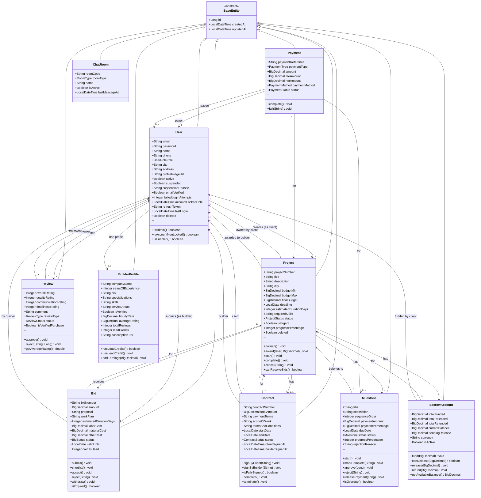
```mermaid
classDiagram
    direction TB

    class BaseEntity {
        <<abstract>>
        +Long id
        +LocalDateTime createdAt
        +LocalDateTime updatedAt
    }

    class User {
        +String email
        +String password
        +String name
        +String phone
        +UserRole role
        +String city
        +String address
        +String profileImageUrl
        +Boolean active
        +Boolean suspended
        +String suspensionReason
        +Boolean emailVerified
        +Integer failedLoginAttempts
        +LocalDateTime accountLockedUntil
        +String refreshToken
        +LocalDateTime lastLogin
        +Boolean deleted
        --
        +isAdmin() boolean
        +isAccountNonLocked() boolean
        +isEnabled() boolean
    }

    class Project {
        +String projectNumber
        +String title
        +String description
        +String city
        +BigDecimal budgetMin
        +BigDecimal budgetMax
        +BigDecimal finalBudget
        +LocalDate deadline
        +Integer estimatedDurationDays
        +String requiredSkills
        +ProjectStatus status
        +Boolean isUrgent
        +Integer progressPercentage
        +Boolean deleted
        --
        +publish() void
        +award(User, BigDecimal) void
        +start() void
        +complete() void
        +cancel(String) void
        +canReceiveBids() boolean
    }

    class Bid {
        +String bidNumber
        +BigDecimal amount
        +String proposal
        +String workPlan
        +Integer estimatedDurationDays
        +BigDecimal laborCost
        +BigDecimal materialCost
        +BigDecimal otherCost
        +BidStatus status
        +LocalDate validUntil
        +Integer creditsUsed
        --
        +submit() void
        +shortlist() void
        +accept() void
        +reject(String) void
        +withdraw() void
        +isExpired() boolean
    }

    class Milestone {
        +String title
        +String description
        +Integer sequenceOrder
        +BigDecimal paymentAmount
        +BigDecimal paymentPercentage
        +LocalDate dueDate
        +MilestoneStatus status
        +Integer progressPercentage
        +String rejectionReason
        --
        +start() void
        +markComplete(String) void
        +approve(Long) void
        +reject(String) void
        +releasePayment(Long) void
        +isOverdue() boolean
    }

    class Contract {
        +String contractNumber
        +BigDecimal totalAmount
        +String paymentTerms
        +String scopeOfWork
        +String termsAndConditions
        +LocalDate startDate
        +LocalDate endDate
        +ContractStatus status
        +LocalDateTime clientSignedAt
        +LocalDateTime builderSignedAt
        --
        +signByClient(String) void
        +signByBuilder(String) void
        +isFullySigned() boolean
        +complete() void
        +terminate() void
    }

    class EscrowAccount {
        +BigDecimal totalFunded
        +BigDecimal totalReleased
        +BigDecimal totalRefunded
        +BigDecimal currentBalance
        +BigDecimal pendingRelease
        +String currency
        +Boolean isActive
        --
        +fund(BigDecimal) void
        +canRelease(BigDecimal) boolean
        +release(BigDecimal) void
        +refund(BigDecimal) void
        +getAvailableBalance() BigDecimal
    }

    class Payment {
        +String paymentReference
        +PaymentType paymentType
        +BigDecimal amount
        +BigDecimal feeAmount
        +BigDecimal netAmount
        +PaymentMethod paymentMethod
        +PaymentStatus status
        --
        +complete() void
        +fail(String) void
    }

    class Review {
        +Integer overallRating
        +Integer qualityRating
        +Integer communicationRating
        +Integer timelinessRating
        +String comment
        +ReviewType reviewType
        +ReviewStatus status
        +Boolean isVerifiedPurchase
        --
        +approve() void
        +reject(String, Long) void
        +getAverageRating() double
    }

    class BuilderProfile {
        +String companyName
        +Integer yearsOfExperience
        +String bio
        +String specializations
        +String skills
        +String serviceAreas
        +Boolean isVerified
        +BigDecimal hourlyRate
        +BigDecimal averageRating
        +Integer totalReviews
        +Integer leadCredits
        +String subscriptionTier
        --
        +hasLeadCredits() boolean
        +useLeadCredit() void
        +addEarnings(BigDecimal) void
    }

    class ChatRoom {
        +String roomCode
        +RoomType roomType
        +String name
        +Boolean isActive
        +LocalDateTime lastMessageAt
    }

    BaseEntity <|-- User
    BaseEntity <|-- Project
    BaseEntity <|-- Bid
    BaseEntity <|-- Milestone
    BaseEntity <|-- Contract
    BaseEntity <|-- EscrowAccount
    BaseEntity <|-- Payment
    BaseEntity <|-- Review
    BaseEntity <|-- BuilderProfile
    BaseEntity <|-- ChatRoom

    User "1" --> "0..1" BuilderProfile : has profile
    User "1" --> "*" Project : creates (as client)
    User "1" --> "*" Bid : submits (as builder)
    User "1" --> "*" Review : writes

    Project "1" --> "*" Bid : receives
    Project "1" --> "*" Milestone : has
    Project "1" --> "0..1" Contract : has
    Project "1" --> "0..1" EscrowAccount : has
    Project "*" --> "1" User : owned by client
    Project "*" --> "0..1" User : awarded to builder

    Bid "*" --> "1" Project : for
    Bid "*" --> "1" User : by builder

    Milestone "*" --> "1" Project : belongs to

    Contract "1" --> "1" Project : for
    Contract "*" --> "1" User : client
    Contract "*" --> "1" User : builder

    EscrowAccount "1" --> "1" Project : for
    EscrowAccount "*" --> "1" User : funded by client

    Payment "*" --> "1" User : payer
    Payment "*" --> "0..1" User : payee
    Payment "*" --> "0..1" Project : for
    Payment "*" --> "0..1" Milestone : for

    Review "*" --> "1" User : reviewer
    Review "*" --> "1" User : reviewee
```

### 1.2 Enumerations

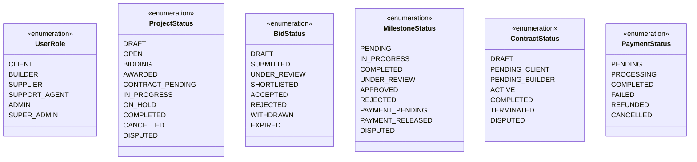
```mermaid
classDiagram
    class UserRole {
        <<enumeration>>
        CLIENT
        BUILDER
        SUPPLIER
        SUPPORT_AGENT
        ADMIN
        SUPER_ADMIN
    }

    class ProjectStatus {
        <<enumeration>>
        DRAFT
        OPEN
        BIDDING
        AWARDED
        CONTRACT_PENDING
        IN_PROGRESS
        ON_HOLD
        COMPLETED
        CANCELLED
        DISPUTED
    }

    class BidStatus {
        <<enumeration>>
        DRAFT
        SUBMITTED
        UNDER_REVIEW
        SHORTLISTED
        ACCEPTED
        REJECTED
        WITHDRAWN
        EXPIRED
    }

    class MilestoneStatus {
        <<enumeration>>
        PENDING
        IN_PROGRESS
        COMPLETED
        UNDER_REVIEW
        APPROVED
        REJECTED
        PAYMENT_PENDING
        PAYMENT_RELEASED
        DISPUTED
    }

    class ContractStatus {
        <<enumeration>>
        DRAFT
        PENDING_CLIENT
        PENDING_BUILDER
        ACTIVE
        COMPLETED
        TERMINATED
        DISPUTED
    }

    class PaymentStatus {
        <<enumeration>>
        PENDING
        PROCESSING
        COMPLETED
        FAILED
        REFUNDED
        CANCELLED
    }
```

---

## 2. System Sequence Diagrams

### 2.1 User Registration

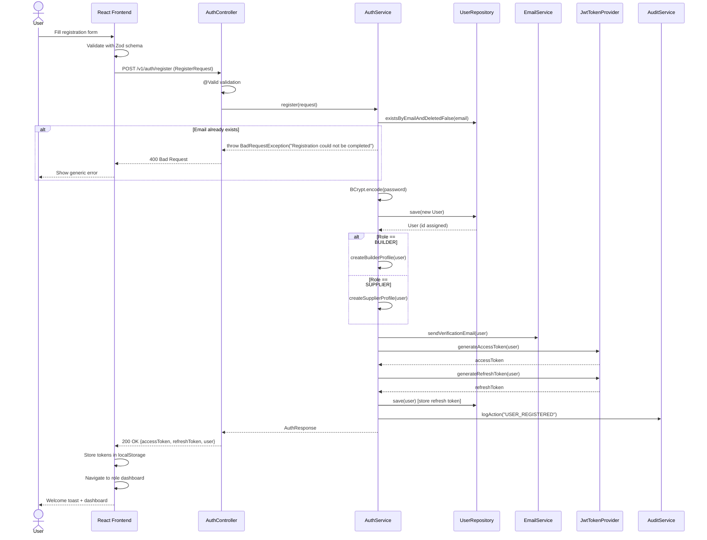
```mermaid
sequenceDiagram
    actor User
    participant UI as React Frontend
    participant AC as AuthController
    participant AS as AuthService
    participant UR as UserRepository
    participant ES as EmailService
    participant JWT as JwtTokenProvider
    participant Audit as AuditService

    User->>UI: Fill registration form
    UI->>UI: Validate with Zod schema
    UI->>AC: POST /v1/auth/register (RegisterRequest)
    AC->>AC: @Valid validation
    AC->>AS: register(request)

    AS->>UR: existsByEmailAndDeletedFalse(email)
    alt Email already exists
        AS-->>AC: throw BadRequestException("Registration could not be completed")
        AC-->>UI: 400 Bad Request
        UI-->>User: Show generic error
    end

    AS->>AS: BCrypt.encode(password)
    AS->>UR: save(new User)
    UR-->>AS: User (id assigned)

    alt Role == BUILDER
        AS->>AS: createBuilderProfile(user)
    else Role == SUPPLIER
        AS->>AS: createSupplierProfile(user)
    end

    AS->>ES: sendVerificationEmail(user)
    AS->>JWT: generateAccessToken(user)
    JWT-->>AS: accessToken
    AS->>JWT: generateRefreshToken(user)
    JWT-->>AS: refreshToken
    AS->>UR: save(user) [store refresh token]
    AS->>Audit: logAction("USER_REGISTERED")

    AS-->>AC: AuthResponse
    AC-->>UI: 200 OK {accessToken, refreshToken, user}
    UI->>UI: Store tokens in localStorage
    UI->>UI: Navigate to role dashboard
    UI-->>User: Welcome toast + dashboard
```

### 2.2 Project Creation and Bidding

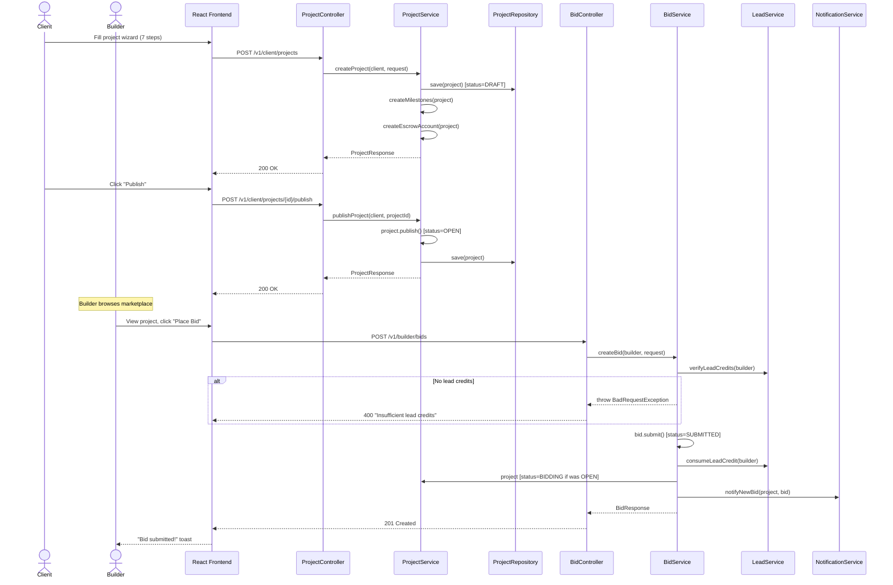
```mermaid
sequenceDiagram
    actor Client
    actor Builder
    participant UI as React Frontend
    participant PC as ProjectController
    participant PS as ProjectService
    participant PR as ProjectRepository
    participant BC as BidController
    participant BS as BidService
    participant LS as LeadService
    participant NS as NotificationService

    Client->>UI: Fill project wizard (7 steps)
    UI->>PC: POST /v1/client/projects
    PC->>PS: createProject(client, request)
    PS->>PR: save(project) [status=DRAFT]
    PS->>PS: createMilestones(project)
    PS->>PS: createEscrowAccount(project)
    PS-->>PC: ProjectResponse
    PC-->>UI: 200 OK

    Client->>UI: Click "Publish"
    UI->>PC: POST /v1/client/projects/{id}/publish
    PC->>PS: publishProject(client, projectId)
    PS->>PS: project.publish() [status=OPEN]
    PS->>PR: save(project)
    PS-->>PC: ProjectResponse
    PC-->>UI: 200 OK

    Note over Builder: Builder browses marketplace

    Builder->>UI: View project, click "Place Bid"
    UI->>BC: POST /v1/builder/bids
    BC->>BS: createBid(builder, request)
    BS->>LS: verifyLeadCredits(builder)
    alt No lead credits
        BS-->>BC: throw BadRequestException
        BC-->>UI: 400 "Insufficient lead credits"
    end
    BS->>BS: bid.submit() [status=SUBMITTED]
    BS->>LS: consumeLeadCredit(builder)
    BS->>PS: project [status=BIDDING if was OPEN]
    BS->>NS: notifyNewBid(project, bid)
    BS-->>BC: BidResponse
    BC-->>UI: 201 Created
    UI-->>Builder: "Bid submitted!" toast
```

### 2.3 Project Award Flow

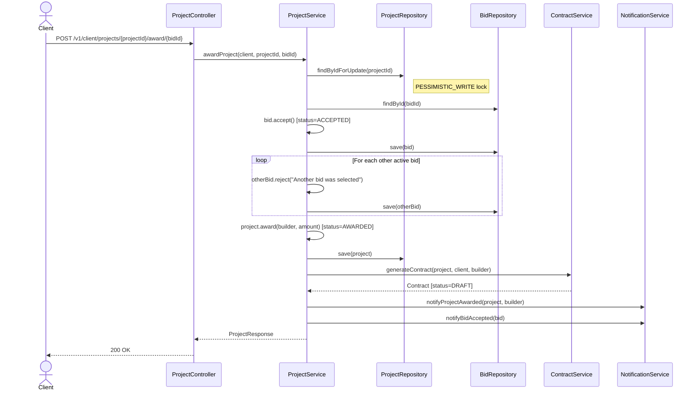
```mermaid
sequenceDiagram
    actor Client
    participant PC as ProjectController
    participant PS as ProjectService
    participant PR as ProjectRepository
    participant BR as BidRepository
    participant CS as ContractService
    participant NS as NotificationService

    Client->>PC: POST /v1/client/projects/{projectId}/award/{bidId}
    PC->>PS: awardProject(client, projectId, bidId)

    PS->>PR: findByIdForUpdate(projectId)
    Note right of PR: PESSIMISTIC_WRITE lock

    PS->>BR: findById(bidId)
    PS->>PS: bid.accept() [status=ACCEPTED]
    PS->>BR: save(bid)

    loop For each other active bid
        PS->>PS: otherBid.reject("Another bid was selected")
        PS->>BR: save(otherBid)
    end

    PS->>PS: project.award(builder, amount) [status=AWARDED]
    PS->>PR: save(project)

    PS->>CS: generateContract(project, client, builder)
    CS-->>PS: Contract [status=DRAFT]

    PS->>NS: notifyProjectAwarded(project, builder)
    PS->>NS: notifyBidAccepted(bid)

    PS-->>PC: ProjectResponse
    PC-->>Client: 200 OK
```

### 2.4 Milestone Completion and Payment Release

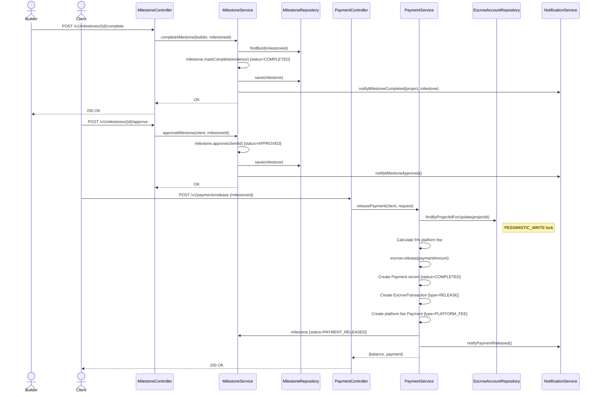
```mermaid
sequenceDiagram
    actor Builder
    actor Client
    participant MC as MilestoneController
    participant MS as MilestoneService
    participant MR as MilestoneRepository
    participant PayC as PaymentController
    participant PayS as PaymentService
    participant ER as EscrowAccountRepository
    participant NS as NotificationService

    Builder->>MC: POST /v1/milestones/{id}/complete
    MC->>MS: completeMilestone(builder, milestoneId)
    MS->>MR: findById(milestoneId)
    MS->>MS: milestone.markComplete(evidence) [status=COMPLETED]
    MS->>MR: save(milestone)
    MS->>NS: notifyMilestoneCompleted(project, milestone)
    MS-->>MC: OK
    MC-->>Builder: 200 OK

    Client->>MC: POST /v1/milestones/{id}/approve
    MC->>MS: approveMilestone(client, milestoneId)
    MS->>MS: milestone.approve(clientId) [status=APPROVED]
    MS->>MR: save(milestone)
    MS->>NS: notifyMilestoneApproved()
    MS-->>MC: OK

    Client->>PayC: POST /v1/payments/release {milestoneId}
    PayC->>PayS: releasePayment(client, request)
    PayS->>ER: findByProjectIdForUpdate(projectId)
    Note right of ER: PESSIMISTIC_WRITE lock

    PayS->>PayS: Calculate 5% platform fee
    PayS->>PayS: escrow.release(paymentAmount)
    PayS->>PayS: Create Payment record [status=COMPLETED]
    PayS->>PayS: Create EscrowTransaction [type=RELEASE]
    PayS->>PayS: Create platform fee Payment [type=PLATFORM_FEE]
    PayS->>MS: milestone [status=PAYMENT_RELEASED]
    PayS->>NS: notifyPaymentReleased()

    PayS-->>PayC: {balance, payment}
    PayC-->>Client: 200 OK
```

### 2.5 Real-Time Chat

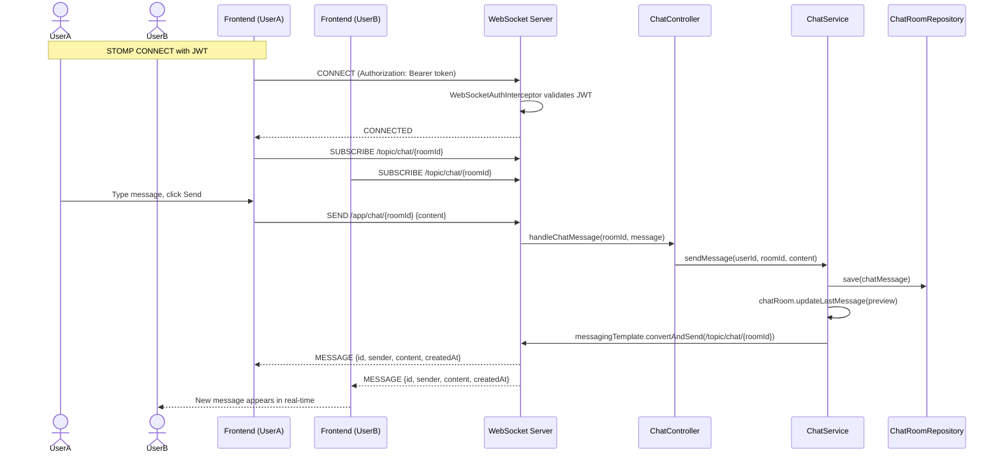
```mermaid
sequenceDiagram
    actor UserA
    actor UserB
    participant UI_A as Frontend (UserA)
    participant UI_B as Frontend (UserB)
    participant WS as WebSocket Server
    participant CC as ChatController
    participant CS as ChatService
    participant CR as ChatRoomRepository

    Note over UserA,UI_A: STOMP CONNECT with JWT

    UI_A->>WS: CONNECT (Authorization: Bearer token)
    WS->>WS: WebSocketAuthInterceptor validates JWT
    WS-->>UI_A: CONNECTED

    UI_A->>WS: SUBSCRIBE /topic/chat/{roomId}
    UI_B->>WS: SUBSCRIBE /topic/chat/{roomId}

    UserA->>UI_A: Type message, click Send
    UI_A->>WS: SEND /app/chat/{roomId} {content}
    WS->>CC: handleChatMessage(roomId, message)
    CC->>CS: sendMessage(userId, roomId, content)
    CS->>CR: save(chatMessage)
    CS->>CS: chatRoom.updateLastMessage(preview)

    CS->>WS: messagingTemplate.convertAndSend(/topic/chat/{roomId})
    WS-->>UI_A: MESSAGE {id, sender, content, createdAt}
    WS-->>UI_B: MESSAGE {id, sender, content, createdAt}

    UI_B-->>UserB: New message appears in real-time
```

---

## 3. State Transition Diagrams

### 3.1 Project Lifecycle

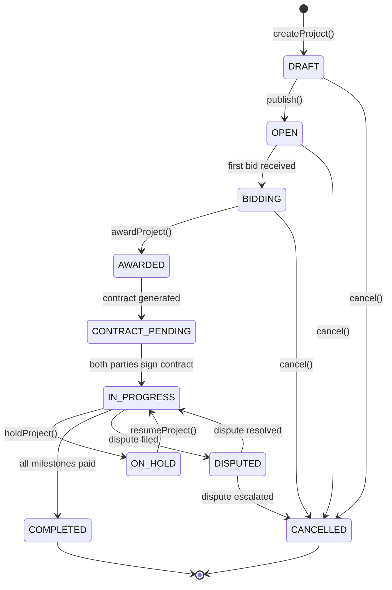
```mermaid
stateDiagram-v2
    [*] --> DRAFT : createProject()

    DRAFT --> OPEN : publish()
    OPEN --> BIDDING : first bid received
    BIDDING --> AWARDED : awardProject()
    AWARDED --> CONTRACT_PENDING : contract generated
    CONTRACT_PENDING --> IN_PROGRESS : both parties sign contract
    IN_PROGRESS --> ON_HOLD : holdProject()
    ON_HOLD --> IN_PROGRESS : resumeProject()
    IN_PROGRESS --> COMPLETED : all milestones paid
    IN_PROGRESS --> DISPUTED : dispute filed

    DRAFT --> CANCELLED : cancel()
    OPEN --> CANCELLED : cancel()
    BIDDING --> CANCELLED : cancel()
    DISPUTED --> IN_PROGRESS : dispute resolved
    DISPUTED --> CANCELLED : dispute escalated

    COMPLETED --> [*]
    CANCELLED --> [*]
```

### 3.2 Bid Lifecycle

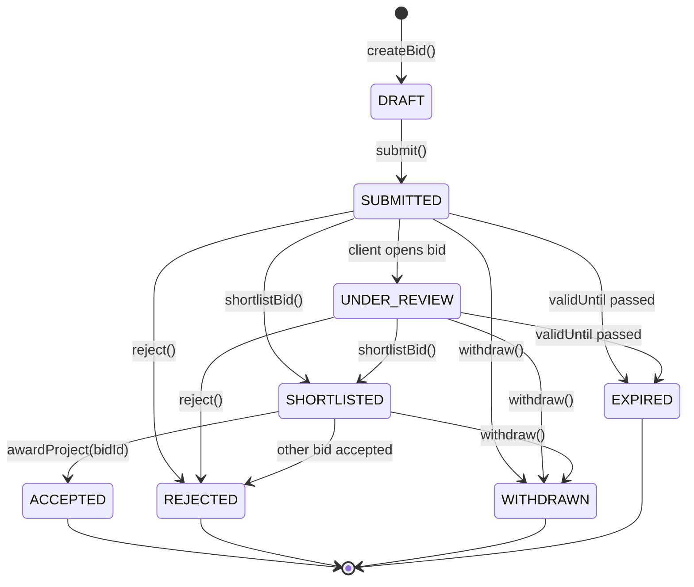
```mermaid
stateDiagram-v2
    [*] --> DRAFT : createBid()

    DRAFT --> SUBMITTED : submit()
    SUBMITTED --> UNDER_REVIEW : client opens bid
    SUBMITTED --> SHORTLISTED : shortlistBid()
    UNDER_REVIEW --> SHORTLISTED : shortlistBid()
    SHORTLISTED --> ACCEPTED : awardProject(bidId)

    SUBMITTED --> REJECTED : reject()
    UNDER_REVIEW --> REJECTED : reject()
    SHORTLISTED --> REJECTED : other bid accepted

    SUBMITTED --> WITHDRAWN : withdraw()
    UNDER_REVIEW --> WITHDRAWN : withdraw()
    SHORTLISTED --> WITHDRAWN : withdraw()

    SUBMITTED --> EXPIRED : validUntil passed
    UNDER_REVIEW --> EXPIRED : validUntil passed

    ACCEPTED --> [*]
    REJECTED --> [*]
    WITHDRAWN --> [*]
    EXPIRED --> [*]
```

### 3.3 Milestone Lifecycle

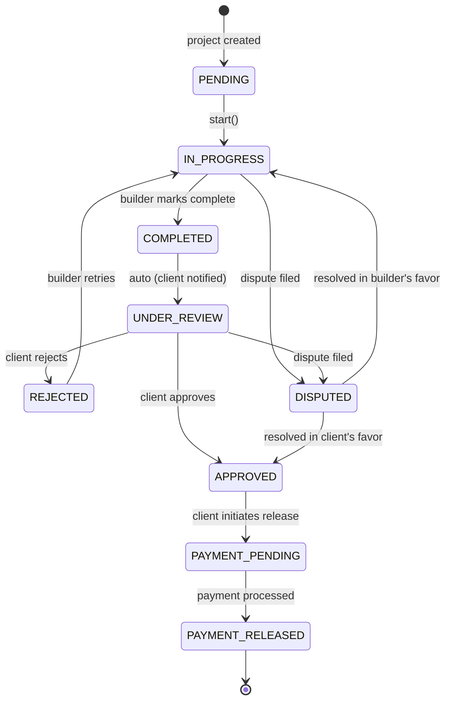
```mermaid
stateDiagram-v2
    [*] --> PENDING : project created

    PENDING --> IN_PROGRESS : start()
    IN_PROGRESS --> COMPLETED : builder marks complete
    COMPLETED --> UNDER_REVIEW : auto (client notified)
    UNDER_REVIEW --> APPROVED : client approves
    UNDER_REVIEW --> REJECTED : client rejects
    REJECTED --> IN_PROGRESS : builder retries
    APPROVED --> PAYMENT_PENDING : client initiates release
    PAYMENT_PENDING --> PAYMENT_RELEASED : payment processed

    IN_PROGRESS --> DISPUTED : dispute filed
    UNDER_REVIEW --> DISPUTED : dispute filed
    DISPUTED --> IN_PROGRESS : resolved in builder's favor
    DISPUTED --> APPROVED : resolved in client's favor

    PAYMENT_RELEASED --> [*]
```

### 3.4 Contract Lifecycle

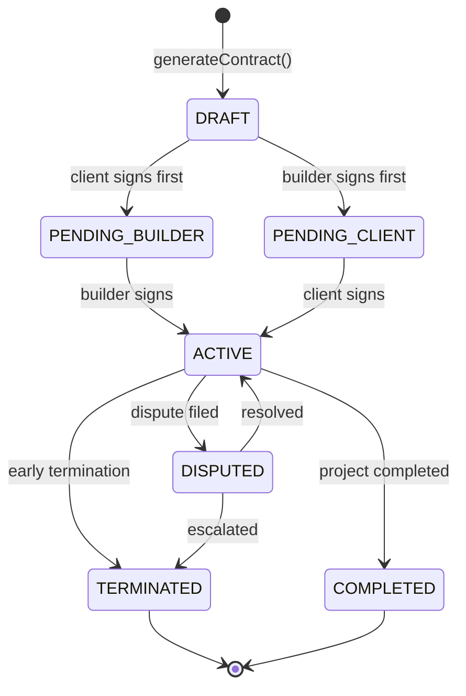
```mermaid
stateDiagram-v2
    [*] --> DRAFT : generateContract()

    DRAFT --> PENDING_BUILDER : client signs first
    DRAFT --> PENDING_CLIENT : builder signs first
    PENDING_BUILDER --> ACTIVE : builder signs
    PENDING_CLIENT --> ACTIVE : client signs

    ACTIVE --> COMPLETED : project completed
    ACTIVE --> TERMINATED : early termination
    ACTIVE --> DISPUTED : dispute filed

    TERMINATED --> [*]
    COMPLETED --> [*]
    DISPUTED --> ACTIVE : resolved
    DISPUTED --> TERMINATED : escalated
```

### 3.5 Payment Lifecycle

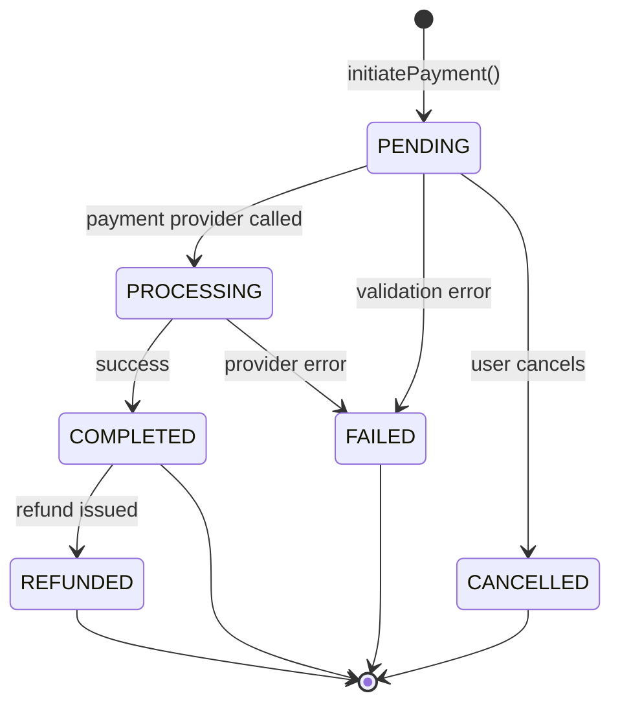
```mermaid
stateDiagram-v2
    [*] --> PENDING : initiatePayment()

    PENDING --> PROCESSING : payment provider called
    PROCESSING --> COMPLETED : success
    PROCESSING --> FAILED : provider error

    PENDING --> FAILED : validation error
    PENDING --> CANCELLED : user cancels

    COMPLETED --> REFUNDED : refund issued

    COMPLETED --> [*]
    FAILED --> [*]
    CANCELLED --> [*]
    REFUNDED --> [*]
```

---

## 4. Use Case Diagrams

### 4.1 Full System Use Case Diagram

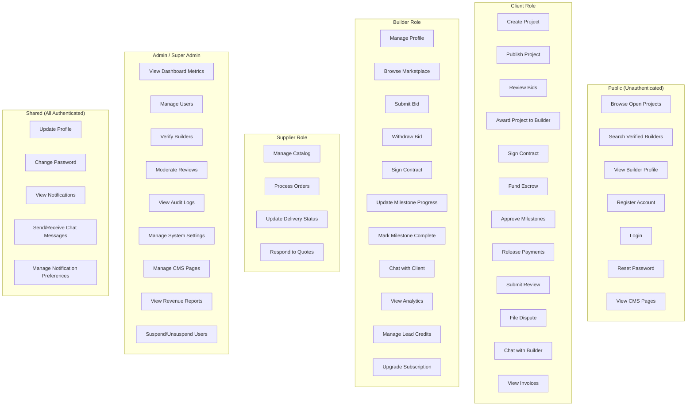
```mermaid
graph TB
    subgraph Public["Public (Unauthenticated)"]
        UC_P1[Browse Open Projects]
        UC_P2[Search Verified Builders]
        UC_P3[View Builder Profile]
        UC_P4[Register Account]
        UC_P5[Login]
        UC_P6[Reset Password]
        UC_P7[View CMS Pages]
    end

    subgraph Client["Client Role"]
        UC_C1[Create Project]
        UC_C2[Publish Project]
        UC_C3[Review Bids]
        UC_C4[Award Project to Builder]
        UC_C5[Sign Contract]
        UC_C6[Fund Escrow]
        UC_C7[Approve Milestones]
        UC_C8[Release Payments]
        UC_C9[Submit Review]
        UC_C10[File Dispute]
        UC_C11[Chat with Builder]
        UC_C12[View Invoices]
    end

    subgraph Builder["Builder Role"]
        UC_B1[Manage Profile]
        UC_B2[Browse Marketplace]
        UC_B3[Submit Bid]
        UC_B4[Withdraw Bid]
        UC_B5[Sign Contract]
        UC_B6[Update Milestone Progress]
        UC_B7[Mark Milestone Complete]
        UC_B8[Chat with Client]
        UC_B9[View Analytics]
        UC_B10[Manage Lead Credits]
        UC_B11[Upgrade Subscription]
    end

    subgraph Supplier["Supplier Role"]
        UC_S1[Manage Catalog]
        UC_S2[Process Orders]
        UC_S3[Update Delivery Status]
        UC_S4[Respond to Quotes]
    end

    subgraph Admin["Admin / Super Admin"]
        UC_A1[View Dashboard Metrics]
        UC_A2[Manage Users]
        UC_A3[Verify Builders]
        UC_A4[Moderate Reviews]
        UC_A5[View Audit Logs]
        UC_A6[Manage System Settings]
        UC_A7[Manage CMS Pages]
        UC_A8[View Revenue Reports]
        UC_A9[Suspend/Unsuspend Users]
    end

    subgraph Shared["Shared (All Authenticated)"]
        UC_SH1[Update Profile]
        UC_SH2[Change Password]
        UC_SH3[View Notifications]
        UC_SH4[Send/Receive Chat Messages]
        UC_SH5[Manage Notification Preferences]
    end
```

### 4.2 Client Use Case Detail

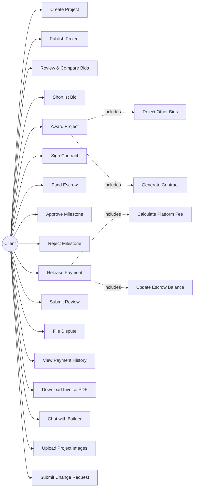
```mermaid
graph LR
    Client((Client))

    Client --> UC1[Create Project]
    Client --> UC2[Publish Project]
    Client --> UC3[Review & Compare Bids]
    Client --> UC4[Shortlist Bid]
    Client --> UC5[Award Project]
    Client --> UC6[Sign Contract]
    Client --> UC7[Fund Escrow]
    Client --> UC8[Approve Milestone]
    Client --> UC9[Reject Milestone]
    Client --> UC10[Release Payment]
    Client --> UC11[Submit Review]
    Client --> UC12[File Dispute]
    Client --> UC13[View Payment History]
    Client --> UC14[Download Invoice PDF]
    Client --> UC15[Chat with Builder]
    Client --> UC16[Upload Project Images]
    Client --> UC17[Submit Change Request]

    UC5 -.->|includes| UC5a[Reject Other Bids]
    UC5 -.->|includes| UC5b[Generate Contract]
    UC10 -.->|includes| UC10a[Calculate Platform Fee]
    UC10 -.->|includes| UC10b[Update Escrow Balance]
```

### 4.3 Builder Use Case Detail

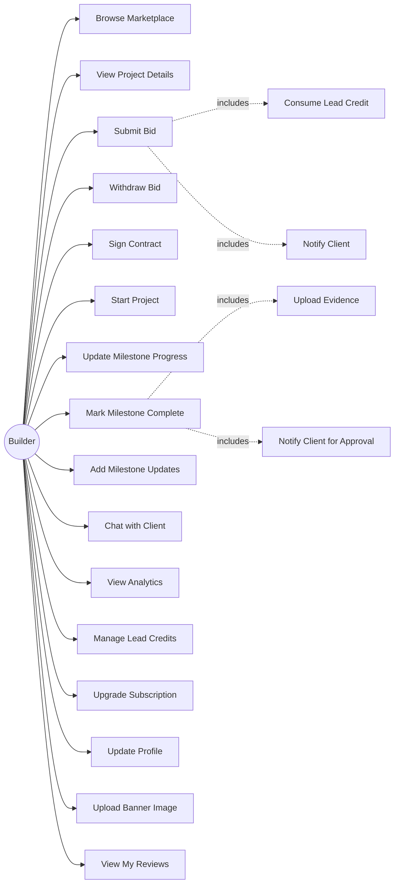
```mermaid
graph LR
    Builder((Builder))

    Builder --> UC1[Browse Marketplace]
    Builder --> UC2[View Project Details]
    Builder --> UC3[Submit Bid]
    Builder --> UC4[Withdraw Bid]
    Builder --> UC5[Sign Contract]
    Builder --> UC6[Start Project]
    Builder --> UC7[Update Milestone Progress]
    Builder --> UC8[Mark Milestone Complete]
    Builder --> UC9[Add Milestone Updates]
    Builder --> UC10[Chat with Client]
    Builder --> UC11[View Analytics]
    Builder --> UC12[Manage Lead Credits]
    Builder --> UC13[Upgrade Subscription]
    Builder --> UC14[Update Profile]
    Builder --> UC15[Upload Banner Image]
    Builder --> UC16[View My Reviews]

    UC3 -.->|includes| UC3a[Consume Lead Credit]
    UC3 -.->|includes| UC3b[Notify Client]
    UC8 -.->|includes| UC8a[Upload Evidence]
    UC8 -.->|includes| UC8b[Notify Client for Approval]
```

---

## How to Render These Diagrams

### Option 1: mermaid.live (Easiest)
1. Go to [mermaid.live](https://mermaid.live)
2. Copy the Mermaid code (everything between the triple backticks after `mermaid`)
3. Paste into the editor
4. Export as PNG or SVG

### Option 2: VS Code Extension
1. Install "Markdown Preview Mermaid Support" extension
2. Open this file in VS Code
3. Press `Ctrl+Shift+V` to preview

### Option 3: GitHub / GitLab
Both platforms render Mermaid diagrams natively in markdown files. Just push this file and view it on the web.

### Option 4: Draw.io / Lucidchart
Use the Mermaid definitions as a reference to recreate diagrams in your preferred tool with custom styling.

### Option 5: Mermaid CLI (PNG/SVG export)
```bash
npm install -g @mermaid-js/mermaid-cli
mmdc -i DIAGRAMS.md -o diagrams/ -e png
```

---

## 5. Process Flow Diagrams

### 5.1 Client Process Flow (End-to-End Project Lifecycle)


```mermaid
flowchart TD
    A([Client Registers]) --> B[Create Project via Wizard]
    B --> B1{Save as Draft?}
    B1 -->|Yes| B2[Project saved as DRAFT]
    B2 --> B3[Edit & Publish later]
    B3 --> C
    B1 -->|No| C[Publish Project]
    C --> D[Project goes OPEN on Marketplace]
    D --> E[Builders submit bids]
    E --> F[Project status: BIDDING]
    F --> G{Review Bids}
    G --> G1[Shortlist promising bids]
    G1 --> G2[Compare proposals, ratings, cost]
    G2 --> H[Award Project to best Builder]
    H --> I[Contract generated automatically]
    I --> J{Sign Contract}
    J -->|Client signs| K[Status: PENDING_BUILDER]
    K --> L[Builder signs]
    L --> M[Contract ACTIVE]
    M --> N[Fund Escrow Account]
    N --> O[Project starts: IN_PROGRESS]

    O --> P{For each Milestone}
    P --> Q[Builder works on milestone]
    Q --> R[Builder marks COMPLETED]
    R --> S{Client Reviews}
    S -->|Approve| T[Milestone APPROVED]
    S -->|Reject| U[Send back with reason]
    U --> Q
    T --> V[Release Payment from Escrow]
    V --> V1[5% platform fee deducted]
    V1 --> W[Payment to Builder]

    W --> X{More Milestones?}
    X -->|Yes| P
    X -->|No| Y[Project COMPLETED]
    Y --> Z[Submit Review for Builder]
    Z --> Z1([Done])

    style A fill:#00A76F,color:#fff
    style Z1 fill:#00A76F,color:#fff
    style H fill:#2563eb,color:#fff
    style V fill:#FFAB00,color:#000
```

### 5.2 Builder Process Flow

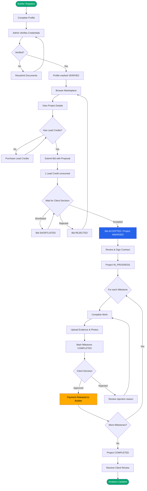
```mermaid
flowchart TD
    A([Builder Registers]) --> B[Complete Profile]
    B --> C[Admin Verifies Credentials]
    C --> D{Verified?}
    D -->|No| E[Resubmit Documents]
    E --> C
    D -->|Yes| F[Profile marked VERIFIED]
    F --> G[Browse Marketplace]
    G --> H[View Project Details]
    H --> I{Has Lead Credits?}
    I -->|No| J[Purchase Lead Credits]
    J --> I
    I -->|Yes| K[Submit Bid with Proposal]
    K --> L[1 Lead Credit consumed]
    L --> M{Wait for Client Decision}
    M -->|Shortlisted| N[Bid SHORTLISTED]
    M -->|Rejected| O[Bid REJECTED]
    M -->|Accepted| P[Bid ACCEPTED / Project AWARDED]
    O --> G
    N --> M

    P --> Q[Review & Sign Contract]
    Q --> R[Project IN_PROGRESS]
    R --> S{For each Milestone}
    S --> T[Complete Work]
    T --> U[Upload Evidence & Photos]
    U --> V[Mark Milestone COMPLETED]
    V --> W{Client Decision}
    W -->|Approved| X[Payment Released to Builder]
    W -->|Rejected| Y[Review rejection reason]
    Y --> T
    X --> Z{More Milestones?}
    Z -->|Yes| S
    Z -->|No| AA[Project COMPLETED]
    AA --> AB[Receive Client Review]
    AB --> AC([Analytics Updated])

    style A fill:#00A76F,color:#fff
    style AC fill:#00A76F,color:#fff
    style P fill:#2563eb,color:#fff
    style X fill:#FFAB00,color:#000
```

### 5.3 Admin Process Flow

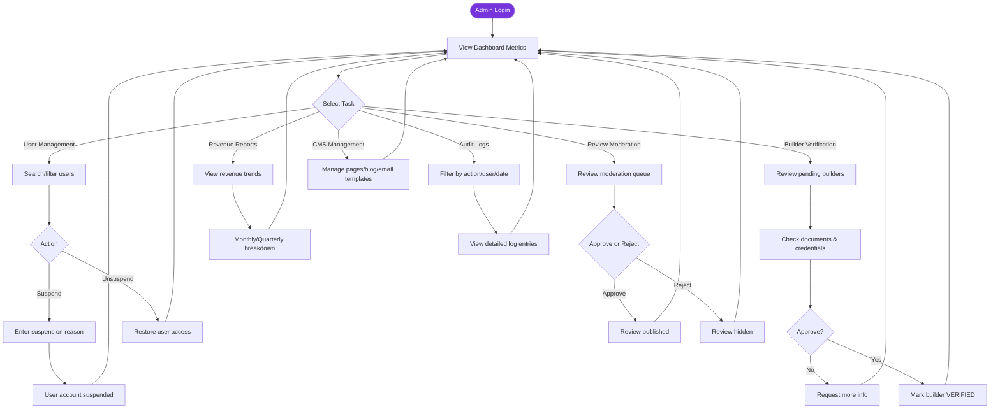
```mermaid
flowchart TD
    A([Admin Login]) --> B[View Dashboard Metrics]
    B --> C{Select Task}

    C -->|Builder Verification| D[Review pending builders]
    D --> D1[Check documents & credentials]
    D1 --> D2{Approve?}
    D2 -->|Yes| D3[Mark builder VERIFIED]
    D2 -->|No| D4[Request more info]
    D3 --> B
    D4 --> B

    C -->|User Management| E[Search/filter users]
    E --> E1{Action}
    E1 -->|Suspend| E2[Enter suspension reason]
    E2 --> E3[User account suspended]
    E1 -->|Unsuspend| E4[Restore user access]
    E3 --> B
    E4 --> B

    C -->|Review Moderation| F[Review moderation queue]
    F --> F1{Approve or Reject}
    F1 -->|Approve| F2[Review published]
    F1 -->|Reject| F3[Review hidden]
    F2 --> B
    F3 --> B

    C -->|Revenue Reports| G[View revenue trends]
    G --> G1[Monthly/Quarterly breakdown]
    G1 --> B

    C -->|Audit Logs| H[Filter by action/user/date]
    H --> H1[View detailed log entries]
    H1 --> B

    C -->|CMS Management| I[Manage pages/blog/email templates]
    I --> B

    style A fill:#7635DC,color:#fff
```

### 5.4 Payment & Escrow Flow

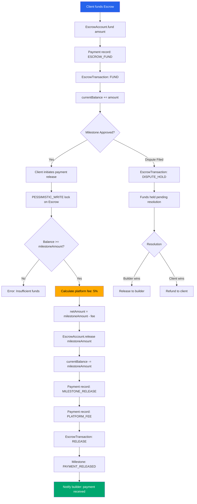
```mermaid
flowchart TD
    A[Client funds Escrow] --> B[EscrowAccount.fund amount]
    B --> C[Payment record: ESCROW_FUND]
    C --> D[EscrowTransaction: FUND]
    D --> E[currentBalance += amount]

    E --> F{Milestone Approved?}
    F -->|Yes| G[Client initiates payment release]
    G --> H[PESSIMISTIC_WRITE lock on Escrow]
    H --> I{Balance >= milestoneAmount?}
    I -->|No| J[Error: Insufficient funds]
    I -->|Yes| K[Calculate platform fee: 5%]
    K --> L[netAmount = milestoneAmount - fee]
    L --> M[EscrowAccount.release milestoneAmount]
    M --> N[currentBalance -= milestoneAmount]
    N --> O[Payment record: MILESTONE_RELEASE]
    O --> P[Payment record: PLATFORM_FEE]
    P --> Q[EscrowTransaction: RELEASE]
    Q --> R[Milestone: PAYMENT_RELEASED]
    R --> S[Notify builder: payment received]

    F -->|Dispute Filed| T[EscrowTransaction: DISPUTE_HOLD]
    T --> U[Funds held pending resolution]
    U --> V{Resolution}
    V -->|Builder wins| W[Release to builder]
    V -->|Client wins| X[Refund to client]

    style A fill:#2563eb,color:#fff
    style K fill:#FFAB00,color:#000
    style S fill:#00A76F,color:#fff
```

---

## 6. Architecture Diagram (Box-and-Line)

### 6.1 System Architecture

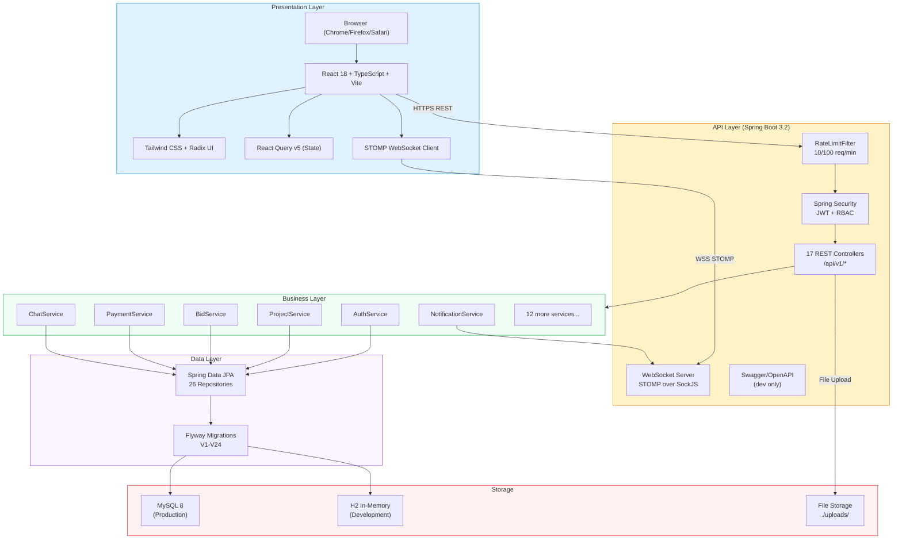
```mermaid
graph TB
    subgraph Client["Presentation Layer"]
        Browser["Browser (Chrome/Firefox/Safari)"]
        ReactApp["React 18 + TypeScript + Vite"]
        TailwindUI["Tailwind CSS + Radix UI"]
        ReactQuery["React Query v5 (State)"]
        WSClient["STOMP WebSocket Client"]
    end

    subgraph API["API Layer (Spring Boot 3.2)"]
        Controllers["17 REST Controllers<br/>/api/v1/*"]
        Security["Spring Security<br/>JWT + RBAC"]
        RateLimit["RateLimitFilter<br/>10/100 req/min"]
        WSServer["WebSocket Server<br/>STOMP over SockJS"]
        Swagger["Swagger/OpenAPI<br/>(dev only)"]
    end

    subgraph Service["Business Layer"]
        AuthSvc["AuthService"]
        ProjectSvc["ProjectService"]
        BidSvc["BidService"]
        PaymentSvc["PaymentService"]
        ChatSvc["ChatService"]
        NotifSvc["NotificationService"]
        OtherSvc["12 more services..."]
    end

    subgraph Data["Data Layer"]
        JPA["Spring Data JPA<br/>26 Repositories"]
        Flyway["Flyway Migrations<br/>V1-V24"]
    end

    subgraph Storage["Storage"]
        MySQL["MySQL 8<br/>(Production)"]
        H2["H2 In-Memory<br/>(Development)"]
        FileStore["File Storage<br/>./uploads/"]
    end

    Browser --> ReactApp
    ReactApp --> TailwindUI
    ReactApp --> ReactQuery
    ReactApp --> WSClient

    ReactApp -->|"HTTPS REST"| RateLimit
    WSClient -->|"WSS STOMP"| WSServer
    RateLimit --> Security
    Security --> Controllers
    Controllers --> Service

    AuthSvc --> JPA
    ProjectSvc --> JPA
    BidSvc --> JPA
    PaymentSvc --> JPA
    ChatSvc --> JPA
    NotifSvc --> WSServer

    JPA --> Flyway
    Flyway --> MySQL
    Flyway --> H2

    Controllers -->|"File Upload"| FileStore

    style Client fill:#e0f2fe,stroke:#0284c7
    style API fill:#fef3c7,stroke:#d97706
    style Service fill:#f0fdf4,stroke:#16a34a
    style Data fill:#faf5ff,stroke:#9333ea
    style Storage fill:#fef2f2,stroke:#dc2626
```

### 6.2 Authentication Flow Architecture

```mermaid
graph LR
    subgraph Frontend
        Login["Login Page"]
        AuthCtx["AuthContext"]
        Axios["Axios Interceptor"]
        LS["localStorage<br/>accessToken<br/>refreshToken"]
    end

    subgraph Backend
        AuthCtrl["AuthController"]
        JWTFilter["JwtAuthenticationFilter"]
        JWTProvider["JwtTokenProvider<br/>HS512 signing"]
        AuthSvc2["AuthService<br/>BCrypt + Lockout"]
        UserRepo["UserRepository"]
    end

    Login -->|"POST /auth/login"| AuthCtrl
    AuthCtrl --> AuthSvc2
    AuthSvc2 -->|"Check lockout"| UserRepo
    AuthSvc2 -->|"BCrypt verify"| AuthSvc2
    AuthSvc2 -->|"Generate tokens"| JWTProvider
    JWTProvider -->|"accessToken + refreshToken"| AuthCtrl
    AuthCtrl -->|"200 OK"| AuthCtx
    AuthCtx --> LS

    Axios -->|"Authorization: Bearer"| JWTFilter
    JWTFilter -->|"Validate + extract claims"| JWTProvider
    JWTFilter -->|"Set SecurityContext"| Backend

    Axios -->|"401 expired"| Axios
    Axios -->|"POST /auth/refresh"| AuthCtrl

    style Frontend fill:#e0f2fe,stroke:#0284c7
    style Backend fill:#fef3c7,stroke:#d97706
```

---

## 7. ER Diagram (Database)

### 7.1 Core Tables (Primary Relationships)

```mermaid
erDiagram
    users ||--o| builder_profiles : "has profile"
    users ||--o| supplier_profiles : "has profile"
    users ||--o{ projects : "creates (client)"
    users ||--o{ bids : "submits (builder)"
    users ||--o{ reviews : "writes"
    users ||--o{ payments : "pays"
    users ||--o{ notifications : "receives"

    projects ||--o{ bids : "receives"
    projects ||--o{ milestones : "has"
    projects ||--o| contracts : "has"
    projects ||--o| escrow_accounts : "has"
    projects ||--o{ project_attachments : "has"
    projects ||--o{ change_requests : "has"

    bids }o--|| users : "by builder"
    bids }o--|| projects : "for project"

    milestones }o--|| projects : "belongs to"
    milestones ||--o{ milestone_updates : "has updates"

    contracts }o--|| projects : "for"
    contracts }o--|| users : "client"
    contracts }o--|| users : "builder"
    contracts ||--o{ contract_versions : "has versions"

    escrow_accounts }o--|| projects : "for"
    escrow_accounts }o--|| users : "funded by"
    escrow_accounts ||--o{ escrow_transactions : "has"

    payments }o--|| users : "payer"
    payments }o--o| users : "payee"
    payments }o--o| projects : "for"
    payments }o--o| milestones : "for"

    chat_rooms ||--o{ chat_messages : "contains"
    chat_rooms ||--o{ chat_room_participants : "has"
    chat_room_participants }o--|| users : "is user"

    reviews }o--|| users : "reviewer"
    reviews }o--|| users : "reviewee"

    users {
        bigint id PK
        varchar email UK
        varchar password
        varchar name
        enum role
        varchar city
        boolean suspended
        int failed_login_attempts
        timestamp account_locked_until
        boolean deleted
    }

    projects {
        bigint id PK
        varchar project_number UK
        varchar title
        text description
        varchar city
        decimal budget_min
        decimal budget_max
        enum status
        bigint client_id FK
        bigint awarded_builder_id FK
        boolean deleted
    }

    bids {
        bigint id PK
        varchar bid_number UK
        decimal amount
        text proposal
        int estimated_duration_days
        enum status
        bigint project_id FK
        bigint builder_id FK
    }

    milestones {
        bigint id PK
        varchar title
        int sequence_order
        decimal payment_amount
        enum status
        bigint project_id FK
    }

    contracts {
        bigint id PK
        varchar contract_number UK
        decimal total_amount
        enum status
        timestamp client_signed_at
        timestamp builder_signed_at
        bigint project_id FK
        bigint client_id FK
        bigint builder_id FK
    }

    escrow_accounts {
        bigint id PK
        decimal total_funded
        decimal total_released
        decimal current_balance
        boolean is_active
        bigint project_id FK
        bigint client_id FK
    }

    payments {
        bigint id PK
        varchar payment_reference UK
        enum payment_type
        decimal amount
        decimal fee_amount
        enum status
        bigint payer_id FK
        bigint payee_id FK
        bigint project_id FK
    }

    chat_rooms {
        bigint id PK
        varchar room_code UK
        enum room_type
        varchar name
        boolean is_active
    }

    reviews {
        bigint id PK
        int overall_rating
        text comment
        enum review_type
        enum status
        bigint reviewer_id FK
        bigint reviewee_id FK
    }

    builder_profiles {
        bigint id PK
        varchar company_name
        int years_of_experience
        text specializations
        boolean is_verified
        decimal average_rating
        int lead_credits
        bigint user_id FK
    }
```

### 7.2 Supporting Tables

```mermaid
erDiagram

    material_orders }o--|| projects : "for"
    material_orders }o--o| users : "supplier"
    material_orders ||--o{ material_order_items : "contains"
    material_orders ||--o{ deliveries : "has"

    support_tickets }o--|| users : "created by"
    disputes }o--|| projects : "about"
    disputes }o--|| users : "filed by"

    audit_logs }o--o| users : "performed by"
    notifications }o--|| users : "for user"
    notification_preferences }o--|| users : "for user"

    subscription_plans ||--o{ builder_profiles : "subscribed"
    lead_transactions }o--|| users : "for builder"

    cms_pages {
        bigint id PK
        varchar slug UK
        varchar title
        text content
        enum status
    }

    blog_posts {
        bigint id PK
        varchar slug UK
        varchar title
        text content
        enum status
    }

    email_templates {
        bigint id PK
        varchar template_key UK
        varchar subject
        text body
    }

    system_settings {
        bigint id PK
        varchar setting_key UK
        varchar setting_value
        enum setting_type
    }

    announcements {
        bigint id PK
        varchar title
        text content
        enum announcement_type
        enum display_position
    }
```

---

## 8. Data Dictionary

### 8.1 Users Table

| Column | Type | Constraints | Description |
|--------|------|------------|-------------|
| id | BIGINT | PK, AUTO_INCREMENT | Unique user identifier |
| email | VARCHAR(100) | UNIQUE, NOT NULL | Login email address |
| password | VARCHAR(255) | NOT NULL | BCrypt hashed password (strength 10) |
| name | VARCHAR(100) | NOT NULL | Full name |
| phone | VARCHAR(20) | | Phone number (e.g., +92-321-1234567) |
| role | ENUM | NOT NULL | CLIENT, BUILDER, SUPPLIER, SUPPORT_AGENT, ADMIN, SUPER_ADMIN |
| city | VARCHAR(100) | | City in Pakistan |
| address | VARCHAR(500) | | Full street address |
| profile_image_url | VARCHAR(500) | | Path to uploaded profile image |
| active | BOOLEAN | DEFAULT TRUE | Account active status |
| suspended | BOOLEAN | DEFAULT FALSE | Whether admin suspended the account |
| suspension_reason | VARCHAR(500) | | Reason for suspension |
| email_verified | BOOLEAN | DEFAULT FALSE | Whether email has been verified |
| failed_login_attempts | INT | DEFAULT 0 | Counter for account lockout (max 5) |
| account_locked_until | TIMESTAMP | NULL | Lockout expiry (15 min after 5 failures) |
| refresh_token | VARCHAR(500) | | Current refresh token for session |
| last_login | TIMESTAMP | | Last successful login time |
| deleted | BOOLEAN | DEFAULT FALSE | Soft delete flag |
| deleted_at | TIMESTAMP | | When soft-deleted |
| created_at | TIMESTAMP | NOT NULL | Record creation time |
| updated_at | TIMESTAMP | | Last modification time |

### 8.2 Projects Table

| Column | Type | Constraints | Description |
|--------|------|------------|-------------|
| id | BIGINT | PK, AUTO_INCREMENT | Unique project identifier |
| project_number | VARCHAR(20) | UNIQUE | Auto-generated (PRJ-YYYY-NNNNN) |
| title | VARCHAR(200) | NOT NULL | Project title |
| description | TEXT | | Detailed project description |
| city | VARCHAR(100) | NOT NULL | Project location city |
| location_address | VARCHAR(500) | | Specific street address |
| budget_min | DECIMAL(15,2) | | Minimum budget in PKR |
| budget_max | DECIMAL(15,2) | | Maximum budget in PKR |
| final_budget | DECIMAL(15,2) | | Awarded bid amount |
| deadline | DATE | | Project deadline |
| estimated_duration_days | INT | | Expected duration |
| required_skills | TEXT | | JSON array of required trade skills |
| status | ENUM | DEFAULT 'DRAFT' | DRAFT, OPEN, BIDDING, AWARDED, CONTRACT_PENDING, IN_PROGRESS, ON_HOLD, COMPLETED, CANCELLED, DISPUTED |
| is_urgent | BOOLEAN | DEFAULT FALSE | Priority flag for marketplace visibility |
| progress_percentage | INT | DEFAULT 0 | Overall completion (0-100) |
| client_id | BIGINT | FK → users.id, NOT NULL | Project owner |
| awarded_builder_id | BIGINT | FK → users.id | Winning builder |
| deleted | BOOLEAN | DEFAULT FALSE | Soft delete flag |
| created_at | TIMESTAMP | NOT NULL | Record creation time |
| updated_at | TIMESTAMP | | Last modification time |

### 8.3 Bids Table

| Column | Type | Constraints | Description |
|--------|------|------------|-------------|
| id | BIGINT | PK, AUTO_INCREMENT | Unique bid identifier |
| bid_number | VARCHAR(20) | UNIQUE | Auto-generated bid reference |
| amount | DECIMAL(15,2) | NOT NULL | Total bid amount in PKR |
| proposal | TEXT | NOT NULL | Builder's proposal text (min 50 chars) |
| work_plan | TEXT | | Optional step-by-step plan |
| estimated_duration_days | INT | NOT NULL | Proposed project duration |
| labor_cost | DECIMAL(15,2) | | Cost breakdown: labor |
| material_cost | DECIMAL(15,2) | | Cost breakdown: materials |
| other_cost | DECIMAL(15,2) | | Cost breakdown: other expenses |
| status | ENUM | DEFAULT 'DRAFT' | DRAFT, SUBMITTED, UNDER_REVIEW, SHORTLISTED, ACCEPTED, REJECTED, WITHDRAWN, EXPIRED |
| valid_until | DATE | | Bid expiry date |
| credits_used | INT | DEFAULT 0 | Lead credits consumed |
| project_id | BIGINT | FK → projects.id, NOT NULL | Target project |
| builder_id | BIGINT | FK → users.id, NOT NULL | Bidding builder |
| created_at | TIMESTAMP | NOT NULL | Bid creation time |
| updated_at | TIMESTAMP | | Last modification time |

### 8.4 Milestones Table

| Column | Type | Constraints | Description |
|--------|------|------------|-------------|
| id | BIGINT | PK, AUTO_INCREMENT | Unique milestone identifier |
| title | VARCHAR(200) | NOT NULL | Milestone name |
| description | TEXT | | Milestone details |
| sequence_order | INT | NOT NULL, DEFAULT 1 | Order within project |
| payment_amount | DECIMAL(15,2) | NOT NULL | Amount released on completion |
| payment_percentage | DECIMAL(5,2) | | Percentage of total budget |
| due_date | DATE | | Expected completion date |
| status | ENUM | DEFAULT 'PENDING' | PENDING, IN_PROGRESS, COMPLETED, UNDER_REVIEW, APPROVED, REJECTED, PAYMENT_PENDING, PAYMENT_RELEASED, DISPUTED |
| progress_percentage | INT | DEFAULT 0 | Milestone completion (0-100) |
| rejection_reason | TEXT | | Client's rejection reason |
| project_id | BIGINT | FK → projects.id, NOT NULL | Parent project |
| created_at | TIMESTAMP | NOT NULL | Record creation time |
| updated_at | TIMESTAMP | | Last modification time |

### 8.5 Contracts Table

| Column | Type | Constraints | Description |
|--------|------|------------|-------------|
| id | BIGINT | PK, AUTO_INCREMENT | Unique contract identifier |
| contract_number | VARCHAR(30) | UNIQUE, NOT NULL | Auto-generated reference |
| total_amount | DECIMAL(15,2) | NOT NULL | Contract value in PKR |
| payment_terms | TEXT | | Payment schedule description |
| scope_of_work | TEXT | | Detailed scope |
| terms_and_conditions | TEXT | | Legal terms |
| start_date | DATE | NOT NULL | Contract start |
| end_date | DATE | NOT NULL | Contract end |
| status | ENUM | DEFAULT 'DRAFT' | DRAFT, PENDING_CLIENT, PENDING_BUILDER, ACTIVE, COMPLETED, TERMINATED, DISPUTED |
| client_signed_at | TIMESTAMP | | Client signature timestamp |
| builder_signed_at | TIMESTAMP | | Builder signature timestamp |
| project_id | BIGINT | FK → projects.id, UNIQUE, NOT NULL | Associated project |
| client_id | BIGINT | FK → users.id, NOT NULL | Client party |
| builder_id | BIGINT | FK → users.id, NOT NULL | Builder party |
| created_at | TIMESTAMP | NOT NULL | Record creation time |
| updated_at | TIMESTAMP | | Last modification time |

### 8.6 Escrow Accounts Table

| Column | Type | Constraints | Description |
|--------|------|------------|-------------|
| id | BIGINT | PK, AUTO_INCREMENT | Unique escrow identifier |
| total_funded | DECIMAL(15,2) | DEFAULT 0 | Total amount deposited |
| total_released | DECIMAL(15,2) | DEFAULT 0 | Total amount paid to builder |
| total_refunded | DECIMAL(15,2) | DEFAULT 0 | Total refunded to client |
| current_balance | DECIMAL(15,2) | DEFAULT 0 | Available balance |
| pending_release | DECIMAL(15,2) | DEFAULT 0 | Held for approved milestones |
| currency | VARCHAR(3) | DEFAULT 'PKR' | Currency code |
| is_active | BOOLEAN | DEFAULT TRUE | Account status |
| project_id | BIGINT | FK → projects.id, UNIQUE, NOT NULL | Associated project |
| client_id | BIGINT | FK → users.id, NOT NULL | Account owner |
| created_at | TIMESTAMP | NOT NULL | Record creation time |
| updated_at | TIMESTAMP | | Last modification time |

### 8.7 Payments Table

| Column | Type | Constraints | Description |
|--------|------|------------|-------------|
| id | BIGINT | PK, AUTO_INCREMENT | Unique payment identifier |
| payment_reference | VARCHAR(50) | UNIQUE, NOT NULL | Payment tracking reference |
| payment_type | ENUM | NOT NULL | ESCROW_FUND, MILESTONE_RELEASE, REFUND, SUBSCRIPTION, LEAD_CREDIT_PURCHASE, PLATFORM_FEE |
| amount | DECIMAL(15,2) | NOT NULL | Gross amount in PKR |
| fee_amount | DECIMAL(15,2) | DEFAULT 0 | Platform fee (5% on milestone release) |
| net_amount | DECIMAL(15,2) | NOT NULL | Amount after fee deduction |
| payment_method | ENUM | DEFAULT 'MOCK' | MOCK, STRIPE, PAYPAL, BANK_TRANSFER, CASH |
| status | ENUM | DEFAULT 'PENDING' | PENDING, PROCESSING, COMPLETED, FAILED, REFUNDED, CANCELLED |
| payer_id | BIGINT | FK → users.id, NOT NULL | Who paid |
| payee_id | BIGINT | FK → users.id | Who received |
| project_id | BIGINT | FK → projects.id | Related project |
| milestone_id | BIGINT | FK → milestones.id | Related milestone |
| created_at | TIMESTAMP | NOT NULL | Record creation time |
| updated_at | TIMESTAMP | | Last modification time |

---

## 9. Design Patterns

### 9.1 Patterns Used

```mermaid
graph TB
    subgraph Creational["Creational Patterns"]
        B1["Builder Pattern<br/><i>Contract generation with<br/>optional clauses, terms,<br/>special conditions</i>"]
        B2["Factory Method<br/><i>NotificationService creates<br/>different notification types<br/>based on event</i>"]
    end

    subgraph Structural["Structural Patterns"]
        S1["Repository Pattern<br/><i>26 Spring Data JPA repos<br/>abstract data access behind<br/>interface (UserRepository, etc.)</i>"]
        S2["DTO Pattern<br/><i>16 Request DTOs + 18 Response<br/>DTOs separate API contract<br/>from entity internals</i>"]
        S3["Proxy Pattern<br/><i>Axios interceptor proxies all<br/>HTTP requests to add JWT token<br/>and handle 401 refresh</i>"]
    end

    subgraph Behavioral["Behavioral Patterns"]
        BH1["Observer Pattern<br/><i>NotificationService + WebSocket<br/>broadcasts events to subscribed<br/>clients in real-time</i>"]
        BH2["Strategy Pattern<br/><i>PaymentMethod enum allows<br/>swapping MOCK/STRIPE/PAYPAL<br/>without changing PaymentService</i>"]
        BH3["Chain of Responsibility<br/><i>Spring Security filter chain:<br/>RateLimit → JWT → Auth →<br/>Controller</i>"]
        BH4["Template Method<br/><i>BaseEntity provides id,<br/>createdAt, updatedAt<br/>inherited by all 29 entities</i>"]
    end

    style Creational fill:#e0f2fe,stroke:#0284c7
    style Structural fill:#f0fdf4,stroke:#16a34a
    style Behavioral fill:#fef3c7,stroke:#d97706
```

### 9.2 Pattern Details and Reasoning

| Pattern | Category | Where Used | Reasoning |
|---------|----------|-----------|-----------|
| **Repository** | Structural | 26 JPA repositories (e.g., `UserRepository`, `ProjectRepository`) | Decouples business logic from data access. Services depend on repository interfaces, not Hibernate/SQL. Enables easy unit testing with mocks. |
| **DTO (Data Transfer Object)** | Structural | `dto/request/` (16 DTOs), `dto/response/` (18 DTOs) | Prevents JPA entities from leaking to API consumers. Controls exactly which fields are exposed. Allows API versioning independent of schema changes. |
| **Observer** | Behavioral | `NotificationService` → WebSocket `/topic/notifications/{email}` and `/topic/chat/{roomId}` | Decouples event producers (services) from consumers (frontend). When a bid is submitted, `NotificationService` broadcasts to all subscribers without the BidService knowing who's listening. |
| **Strategy** | Behavioral | `PaymentMethod` enum: MOCK, STRIPE, PAYPAL, BANK_TRANSFER, CASH | Payment processing logic can switch providers without modifying `PaymentService`. Currently uses MOCK; production switches to STRIPE by changing the enum value. |
| **Chain of Responsibility** | Behavioral | Spring Security filter chain: `RateLimitFilter` → `JwtAuthenticationFilter` → `UsernamePasswordAuthenticationFilter` | Each filter handles one concern (rate limiting, JWT validation, authentication) and passes to the next. New filters (e.g., IP blacklist) can be added without modifying existing ones. |
| **Template Method** | Behavioral | `BaseEntity` provides `id`, `createdAt`, `updatedAt` fields inherited by all 29 entities | Eliminates duplication of audit fields. All entities automatically get timestamping via `@MappedSuperclass` + Spring Data Auditing. |
| **Builder** | Creational | Contract generation in `ContractService` — scope, terms, clauses, dates assembled step-by-step | Contracts have many optional fields (special clauses, payment terms, etc.). Builder pattern allows constructing valid contracts without a 15-parameter constructor. |
| **Proxy** | Structural | Axios interceptor in `services/api.ts` — adds `Authorization: Bearer` header, intercepts 401 for token refresh | Frontend code calls `api.get('/projects')` without knowing about JWT tokens. The interceptor transparently handles authentication, token refresh, and 429 rate limit responses. |
| **Singleton** | Creational | Spring-managed beans (`@Component`, `@Service`, `@Repository`) are singletons by default | Services and repositories are stateless — one instance per JVM is sufficient. Spring manages lifecycle, preventing resource waste from multiple instances. |

---

## Diagram Summary

| Diagram Type | Count | Coverage |
|-------------|-------|---------|
| Class Diagrams | 2 | 10 core entities + 6 enums |
| Sequence Diagrams | 5 | Registration, Bidding, Award, Payment, Chat |
| State Transition Diagrams | 5 | Project, Bid, Milestone, Contract, Payment |
| Use Case Diagrams | 3 | System-wide + Client detail + Builder detail |
| Process Flow Diagrams | 4 | Client, Builder, Admin, Payment/Escrow |
| Architecture Diagrams | 2 | System layers + Auth flow |
| ER Diagrams | 2 | Core tables + Supporting tables |
| Data Dictionary | 7 | users, projects, bids, milestones, contracts, escrow, payments |
| Design Patterns | 2 | Pattern map + reasoning table (9 patterns) |
| **Total** | **32** | **Full SDD coverage** |
